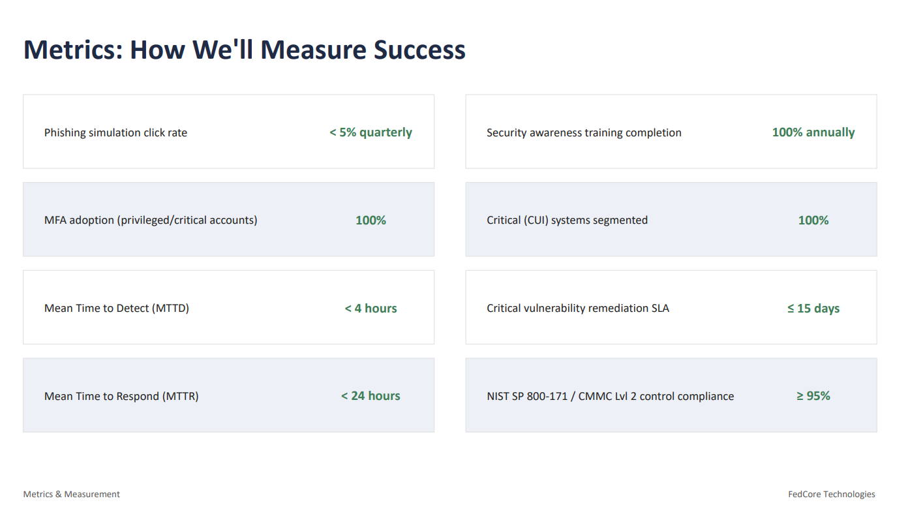

# Project Highlights

The following figures summarize the key findings and recommendations from the enterprise cybersecurity strategy.

## Executive Summary

The executive summary provides senior leadership with a high-level overview of FedCore Technologies' cybersecurity posture, highest-priority risks, recommended initiatives, and proposed FY26 cybersecurity investment.

---

## Enterprise Risk Assessment

A quantitative risk assessment was conducted using Annual Loss Expectancy (ALE) to identify the organization's highest financial risks. Phishing and ransomware represent the greatest financial exposures and guided both strategic priorities and budget allocation.

---

## Security Investment Plan

The proposed FY26 cybersecurity budget allocates **$35,000** across key security initiatives including Multi-Factor Authentication (MFA), Endpoint Detection & Response (EDR), Backup & Disaster Recovery, Email Security, and Security Awareness Training.

---

## Cybersecurity Performance Metrics

Key Performance Indicators (KPIs) were established to measure the effectiveness of the cybersecurity program, including phishing resilience, MFA adoption, Mean Time to Detect (MTTD), Mean Time to Respond (MTTR), vulnerability remediation, and compliance readiness.

---
