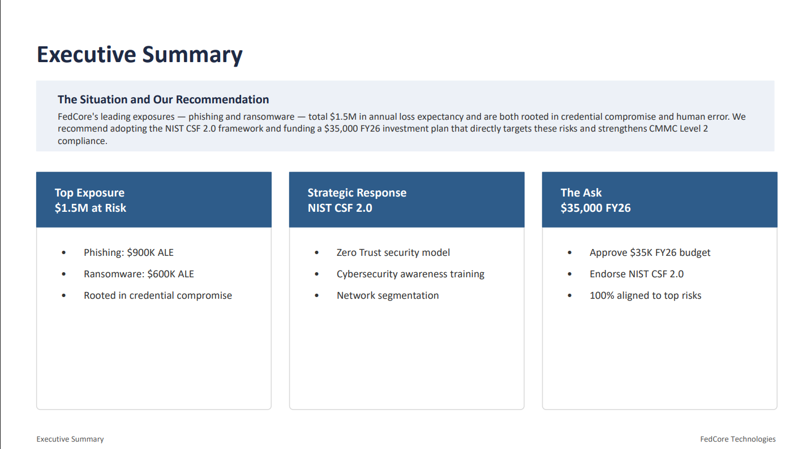
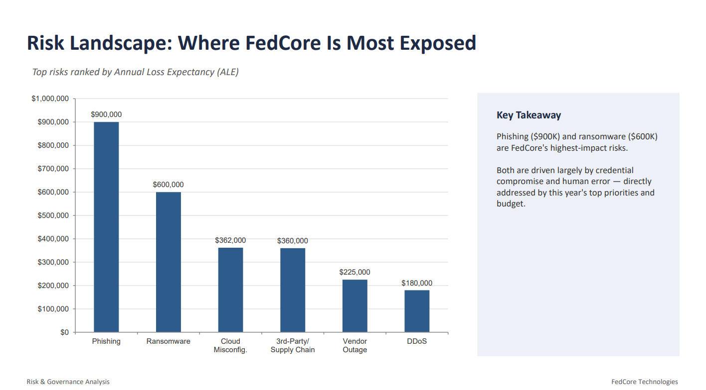
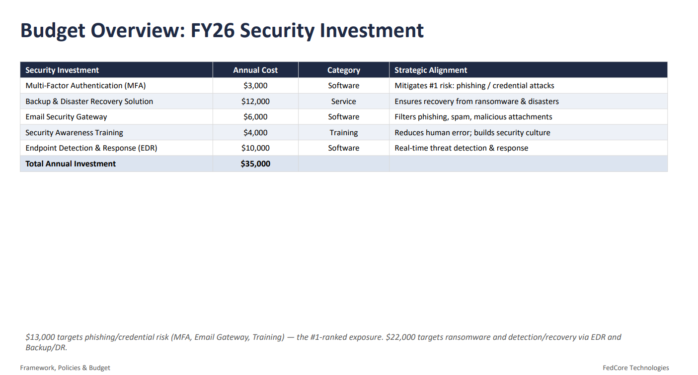

---

# Project Highlights

The following figures summarize key findings and recommendations from the enterprise cybersecurity strategy.

## Executive Summary

The executive summary provides senior leadership with a high-level overview of FedCore Technologies' cybersecurity posture, the highest-priority risks, recommended strategic initiatives, and the proposed FY26 cybersecurity investment.

---

## Enterprise Risk Assessment

A quantitative risk assessment was performed using **Annual Loss Expectancy (ALE)** to identify the organization's highest financial risks. The analysis determined that phishing and ransomware represent the greatest threats, guiding both strategic priorities and budget allocation.

---

## FY26 Cybersecurity Investment Plan

The proposed **$35,000 annual cybersecurity budget** prioritizes investments that directly reduce the organization's highest-ranked risks. Funding supports Multi-Factor Authentication (MFA), Endpoint Detection & Response (EDR), Backup & Disaster Recovery, Email Security, and Security Awareness Training.

---

## Cybersecurity Performance Metrics

Key Performance Indicators (KPIs) were developed to measure the effectiveness of the cybersecurity program. These metrics include phishing resilience, security awareness completion, MFA adoption, Mean Time to Detect (MTTD), Mean Time to Respond (MTTR), vulnerability remediation, and CMMC compliance.

---
